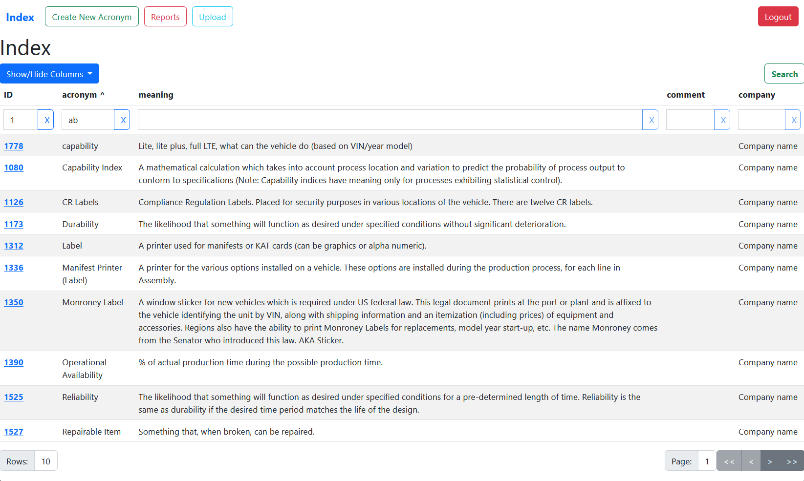
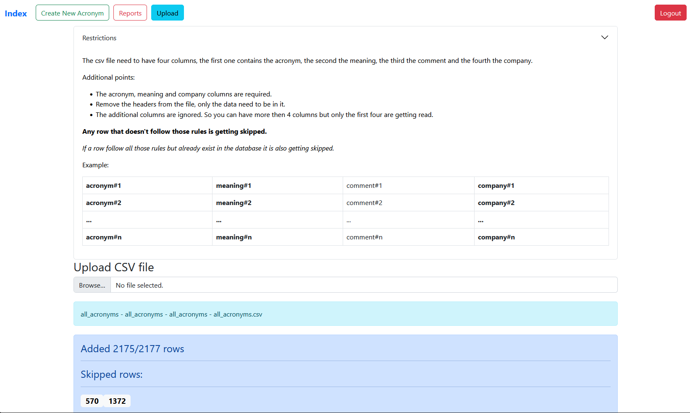

# Acronym Aggregator

[](https://github.com/kaidalisohaib/acronym-aggregator/actions/workflows/ci.yml)


A full-stack web application for centralizing, managing, and reporting on organizational acronyms, built with a Python/Flask backend and an Ember.js frontend.





---

## Table of Contents

- [Acronym Aggregator](#acronym-aggregator)
  - [Table of Contents](#table-of-contents)
  - [About The Project](#about-the-project)
  - [Key Features](#key-features)
  - [Tech Stack](#tech-stack)
  - [Architecture \& Design](#architecture--design)
  - [Getting Started](#getting-started)
    - [Prerequisites](#prerequisites)
    - [Installation](#installation)
  - [Usage](#usage)
  - [Technical Challenges \& Lessons Learned](#technical-challenges--lessons-learned)
    - [1. Implementing a Robust, Server-Side Data Table](#1-implementing-a-robust-server-side-data-table)
    - [2. End-to-End Containerization and CI for a Full-Stack Application](#2-end-to-end-containerization-and-ci-for-a-full-stack-application)
  - [Future Improvements](#future-improvements)
  - [License](#license)

## About The Project

In any large organization or technical field, the proliferation of acronyms can create a knowledge barrier, making it difficult for new team members to get up to speed and for existing members to communicate effectively across departments. The Acronym Aggregator is a web-based solution designed to solve this problem by providing a centralized, searchable, and user-friendly platform for managing acronyms.

This project is a complete full-stack application, demonstrating a wide range of software engineering skills from backend API design and database management to modern frontend development and DevOps practices. It serves as a single source of truth for all company-specific terminology, improving clarity and efficiency.

## Key Features

-   **🗂️ Full CRUD Acronym Management:** Authenticated users can create, read, update, and delete acronyms through a clean and intuitive user interface.
-   **⚡ Advanced Data Table:** The main table is highly dynamic, featuring server-side pagination, multi-column filtering, and sorting to handle large datasets efficiently without degrading frontend performance.
-   **🔐 Secure User Authentication:** A robust registration and login system using JSON Web Tokens (JWT) ensures that only authorized users can modify the acronym database.
-   **⬆️ Bulk CSV Import:** Users can bulk-add acronyms by uploading a CSV file. The backend includes validation to process valid rows and report any skipped entries, ensuring data integrity.
-   **📄 Report Generation:** The system can generate and download versioned reports of the entire acronym database in a `.zip` archive containing CSV files.

## Tech Stack

This project is built with a modern, containerized stack that emphasizes best practices in both frontend and backend development.

| Category          | Technologies                                                                                                                                                                             |
| ----------------- | ---------------------------------------------------------------------------------------------------------------------------------------------------------------------------------------- |
| **Backend**       | `Python`, `Flask`, `Flask-RESTful`, `SQLAlchemy (ORM)`, `Flask-JWT-Extended`                                                                                                                 |
| **Frontend**      | `JavaScript`, `Ember.js (Octane)`, `Ember-Data`, `Ember-Concurrency`, `HTML5`, `CSS3`                                                                                                        |
| **Database**      | `PostgreSQL`                                                                                                                                                                             |
| **DevOps & Tooling** | `Docker`, `Docker Compose`, `GitHub Actions (CI)`, `Pytest`, `QUnit`, `Pre-commit`, `Black`, `ESLint`, `Alembic`                                                                                        |

## Architecture & Design

The application follows a classic client-server architecture, with a clear separation of concerns between the frontend and backend.

-   **Backend (Flask API):** The backend is a stateless, **JSON:API compliant** REST API. It handles all business logic, database interactions, and user authentication. All endpoints are organized as resources using Flask-RESTful for clean, maintainable code.
-   **Frontend (Ember.js SPA):** The frontend is a modern Single Page Application (SPA) built with Ember.js. It consumes the backend API for all data operations. Ember-Data manages the state and communication with the JSON:API backend, while authenticated routes protect sensitive actions.
-   **Containerization:** The entire application stack (backend, frontend, and databases for development/testing) is containerized using **Docker** and orchestrated with **Docker Compose**. This ensures a consistent, portable, and easily reproducible development environment.

## Getting Started

Thanks to Docker, setting up a local development environment is incredibly simple.

### Prerequisites

-   [Docker Desktop](https://www.docker.com/products/docker-desktop/) installed and running.

### Installation

1.  **Clone the repository:**
    ```sh
    git clone https://github.com/kaidalisohaib/acronym-aggregator.git
    cd acronym-aggregator
    ```
2.  **Create an environment file:**
    Copy the example environment file for the backend. The default values are sufficient for local development.
    ```sh
    cp backend/.env.example backend/.env
    ```
3.  **Build and run the containers:**
    This command will build the images for the backend and frontend, and start all the necessary services.
    ```sh
    docker compose up --build
    ```
    You can add the `-d` flag to run the containers in detached mode.

4.  **Access the application:**
    Once the build is complete, open your browser and navigate to `http://localhost:4200`.

## Usage

After starting the application, you can:
1.  **Register a new user** by clicking the "Register" button in the navigation bar.
2.  **Log in** with your new credentials.
3.  **Create an acronym** using the "Create New Acronym" button.
4.  On the main page, **filter and sort** the acronyms table by typing in the search boxes under the column headers or clicking the headers themselves.
5.  **Upload a CSV file** of acronyms via the "Upload" page (note the required format).
6.  **Generate a report** of all acronyms from the "Reports" page.

## Technical Challenges & Lessons Learned

This project provided opportunities to solve interesting technical challenges that are common in professional software development.

### 1. Implementing a Robust, Server-Side Data Table

-   **The Problem:** Displaying a potentially large dataset of acronyms on the frontend could lead to major performance issues if all data were fetched at once. A simple client-side table would be slow, unresponsive, and memory-intensive.
-   **The Solution:** I implemented a server-side processing model. The Flask backend API (`/api/acronyms`) was designed to accept query parameters for pagination (`page`, `display_per_page`), sorting (`sorting[column]`), and multi-column filtering (`filter[...]`). The `build_acronyms_filter_sort_query` utility function dynamically constructs the final SQLAlchemy query based on these parameters. On the frontend, the Ember.js component passes the current state of the table (page number, filters, etc.) to `ember-data`, which fetches only the precise slice of data needed for the current view.
-   **What I Learned:** This process taught me how to design efficient, scalable APIs for data-heavy applications. I learned to manage complex state in a frontend SPA and gained a deep appreciation for the performance benefits of delegating data processing to the backend and database.

### 2. End-to-End Containerization and CI for a Full-Stack Application

-   **The Problem:** Ensuring a consistent development environment across different machines and automating the testing process for both the Python backend and JavaScript frontend can be complex.
-   **The Solution:** I used Docker and Docker Compose to define and link all services (backend API, frontend SPA, PostgreSQL database). This guarantees that the application runs the same way everywhere. Furthermore, I created a **GitHub Actions CI pipeline** (`.github/workflows/ci.yml`) that spins up the entire Docker stack, waits for services to be healthy, and then executes the backend (`pytest`) and frontend (`ember test`) test suites inside their respective containers on every push.
-   **What I Learned:** This project gave me invaluable, hands-on experience in DevOps. I learned to manage multi-container applications, write clean Dockerfiles, and configure a complete Continuous Integration pipeline from scratch. This demonstrates a strong understanding of the full software development lifecycle beyond just writing code.

## Future Improvements

-   **Implement Role-Based Access Control:** Introduce "Admin" and "User" roles, where only admins can delete acronyms.
-   **Add Full-Text Search:** Integrate a more powerful search engine like Elasticsearch or utilize PostgreSQL's built-in full-text search for more flexible querying.
-   **Refactor Frontend to TypeScript:** Migrate the Ember.js application to TypeScript to improve code quality, maintainability, and type safety.
-   **Enhance Report Generation:** Add PDF generation for reports alongside the existing CSV format.

## License

Distributed under the MIT License. See `LICENSE` for more information.